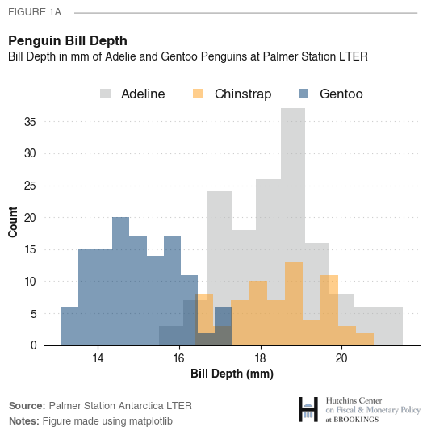
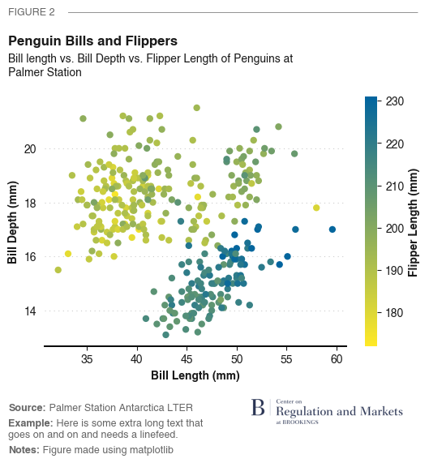
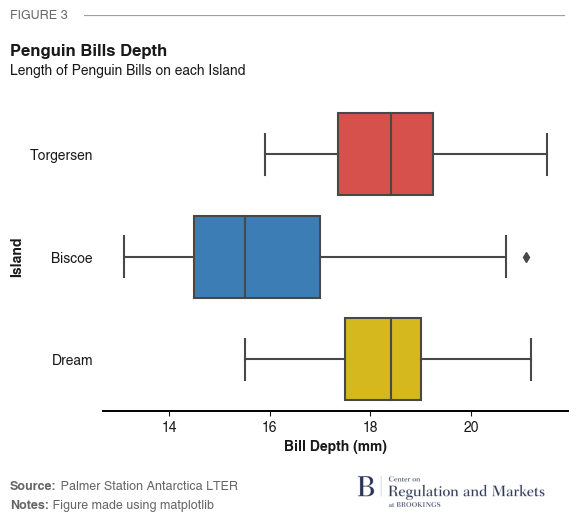
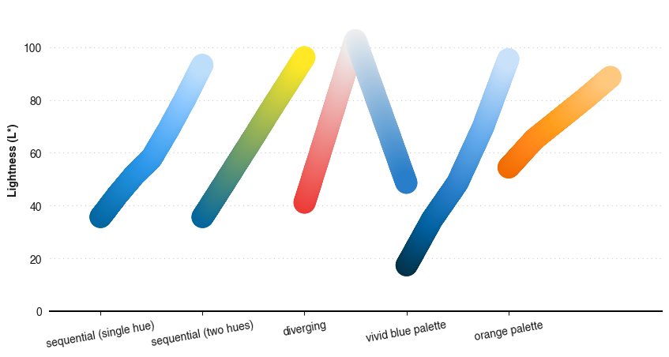

# pyplotbrookings 

## Overview

`pyplotbrookings` is a `matplotlib` extension which implements the Brookings
Institution style guide. It offers several color palettes, a custom theme, and a few
helper functions. `pyplotbrookings` is a python implementation of [`ggbrookings`](https://brookingsinstitution.github.io/ggbrookings/), 
an R extension for `ggplot`.

## Installation

`pyplotbrookings` is now a python package! It downloaded from PyPI with `pip` (https://pypi.org/project/pyplotbrookings/)!
```
pip install pyplotbrookings
```

The accepted alias for `pyplotbrookings` is `ppb`. For example,
```python
import pyplotbrookings.pyplotbrookings as ppb
```

## Usage

The `pyplotbrookings` package has a few simple user facing functions:

-   `set_theme()` overrides the default `matplotlib` theme for a
    custom one which adheres to the Brookings style guide.

-   `get_palette()` returns the colors for a valid Brookings brand 
    palettes.

-   `set_palette()` sets the `matplotlib` color cycler to one of
    the Brookings brand palettes.
    - Valid color palettes are: `1-color A`, `1-color B`, `2-color A`, `2-color B`, `3-color A`, `3-color B`, `4-color A`,
        `4-color B`, `5-color`, `6-color`, `sequential (single hue)`, `sequential (two hues)`, `diverging`, 
        `pos-neg A`, `pos-neg B`, `2-political A`, `2-political B`, `3-political A`, `3-political B`, 
        `brand blue`, `vivid blue`, `teal`, `green`, `yellow`, `orange`, `red`, `magenta`, `purple`, `gray`
        
-   `get_color()` returns a Brookings brand color (e.g., "orange 20") from one of the extended color palettes

-   `make_palette()` adds a custom named palette to the set of valid Brookings palettes

-   `get_cmap()` returns a continuous palette (or color map) using one of
    the color Brookings color palettes.

-   `view_palette()` helper function that previews a color palette
    showing the color, order, and the appropriate text color 
    that can be applied on top of each color.

-   `add_title()` adds titles and subtitles to a figure that are consistent 
    with Brookings brand guidelines. 

-   `add_notes()` adds notes to the bottom of a figure also consistent 
    with Brookings brand guidelines.

-   `add_logo()` adds a program/center logo to a figure.
    - You can add a logo using a local path or use one of the logos that comes with `pyplotbrookings`.
    - The following logos are included with pyplotbrookings: `bc` (Brown Center), `bi` (Bass Initiative on Innovation and Placemaking), `brookings` (Brookings Institution), `cc` (China Center), `ccf` (Center on Children and Families), `ceaps` (Center for East Asia Policy Studies), `cepm` (Center for Effective Policy Management), `chp` (Center for Health Policy), `cmep` (Center for Middle Eastern Policy), `crm` (Center on Regulation and Markets), `csd` (Center for Sustainable Development), `cti` (Center for Technology Innovation), `cue` (Center for Universal Education), `cuse` (Center on United States and Europe), `es` (Economic Studies), `fp` (Foreign Policy), `global` (Global Studies), `gs` (Governance Studies), `hc` (Hutchins Center), `metro` (Metropolitan Policy Studies), `thp` (The Hamilton Project).

-   `figure()` creates a `matplotlib` figure in one of the standard 
    Brookings sizes.

-   `save()` saves a figure in the Brookings advised dpi values depending
     on content type.

## Best Practices

### Brand
For general design and brand requirements we recommend referencing the Brookings [Brand Guidelines](https://brookingsinstitution.sharepoint.com/sites/IBCommunications/SiteAssets/Forms/AllItems.aspx?id=%2Fsites%2FIBCommunications%2FSiteAssets%2FSitePages%2FCrea%2FVisual%2DIdentity%2DGuidelines%2D2023%5F07%5F07%2Epdf&parent=%2Fsites%2FIBCommunications%2FSiteAssets%2FSitePages%2FCrea).

### Terminology
Brookings uses the [following terminologies](https://www.brookings.edu/wp-content/uploads/2019/09/RaceEthnicityStyleGuideUpdates092319.pdf) in reference to racial/ethnic groups or individuals residing within the United States, corresponding to the census-based categories in parentheses.
- Brookings’ publications capitalize **Black**, with flexibility to use **African American** (census-based racial category: Black or African American).
- Brookings’ publications use **white** (census-based racial category: White). 
- Brookings’ publications use **Asian American** (census-based racial category: Asian).
- Brookings’ publications use **Native Hawaiian and Pacific Islander** (census-based racial category: Native Hawaiian or Other Pacific Islander) 
- Brookings’ publications use **American Indian**, or alternatively, **Native American** (census-based racial category: American Indian or Alaska Native).
- Brookings’ publications use Latino or Hispanic (census-based ethnic category: **Hispanic or Latino**). 

### Do No Harm
Often the **data** that we work with at Brookings **are people**. **It's our obligation and responsibility to respect individuals we are communicating about and avoid perpetuating harm in advertently**. We recommend users refer to the work done by Jonathan Schwabish and Alice Feng at the Urban Institute on applying racial equity to data visualization. 
- [*Do No Harm*](https://www.urban.org/sites/default/files/publication/104296/do-no-harm-guide.pdf) report
- [Data@Urban](https://urban-institute.medium.com/) 
- [Jonathan Schwabish](https://policyviz.com/about/) homepage 

### Accessability 
Accessible visualizations should communicate information in *multiple* different forms (text, color, shape, size, etc). The brand color palettes are robust against the various forms of colorblindness; however, where possible we suggest that figures include the following.

- [Different markers](https://matplotlib.org/stable/api/markers_api.html) in scatter plots to denote different subsets of data. 
- [Various line styles](https://matplotlib.org/stable/gallery/lines_bars_and_markers/linestyles.html) (and/or thickness) in line plots to differentiate series from one another.
- Add [hatching](https://matplotlib.org/stable/gallery/shapes_and_collections/hatch_style_reference.html) to fills on bar/box plots.
- Use color! 🌈
- Label data with text annotations where appropriate. 

We also suggest submitting [alt text](https://en.wikipedia.org/wiki/Alt_attribute), [describing your figure](https://accessibility.huit.harvard.edu/describe-content-images), to Communications so that screen readers can read your figures.

## Updates
### What's New?! 🚀 
- Plotting has been updated to be consistent with the new [Brand Guidelines](https://brookingsinstitution.sharepoint.com/sites/IBCommunications/SiteAssets/Forms/AllItems.aspx?id=%2Fsites%2FIBCommunications%2FSiteAssets%2FSitePages%2FCrea%2FVisual%2DIdentity%2DGuidelines%2D2023%5F07%5F07%2Epdf&parent=%2Fsites%2FIBCommunications%2FSiteAssets%2FSitePages%2FCrea).
- New palettes, a color picker, and palette maker have been added!
    - Many palettes have been removed or renamed. If an older palette is critical all hope is not lost, just add it back in with `ppb.make_palette()`.
-  New fonts and titles (Roboto and Helvetica are out, Inter is in!). Old fonts are included in this distribution if needed.
-  As always please reach out if you find bugs or styling inconsistencies. Thank you so much!

## Contact
To report any bugs or discuss contributing to this package please contact Adam Sedlak or Valerie Wirtschafter.

## Examples
Let's create a figure plot using `pyplotbrookings`. First we'll need some data

```python
import matplotlib.pyplot as plt
import pyplotbrookings.pyplotbrookings as ppb
import seaborn as sns

# Brookings plot theme for all plots
ppb.set_theme()

# Getting data
penguins = sns.load_dataset("penguins")
```

Now we can create a figure using the following 
```python
# Reversing data to get the correct z-order ordering of plots
ax = sns.histplot(data=penguins.iloc[::-1], 
                  x='bill_depth_mm', 
                  hue='species', 
                  # Setting the plot palette to Brookings 3-colors
                  palette=ppb.get_palette('3-color B'), 
                  bins=20)

# Moving the legend in seaborn to the top
sns.move_legend(ax, "lower center", bbox_to_anchor=(.5, 1.05), ncol=3, title=None, frameon=False)
plt.xlabel('Bill Depth (mm)')

# Adding Brookings titles
ppb.add_title(title='Penguin Bill Depth', 
              subtitle='Bill Depth in mm of Adelie and Gentoo Penguins at Palmer Station LTER', 
              tag='FIGURE 1B')

# Adding notes
ppb.add_notes('Source: Palmer Station Antarctica LTER', 
              'Notes: Figure made using matplotlib')

ppb.add_logo('hc')
```



`pyplotbrookings` is designed to work with many different plots. Let's try creating a scatter plot that uses a colormap

```python
# Getting the Brookings sequential colormap
cmap = ppb.get_cmap('sequential (two hues)', reverse=True)
# Creating a scatter plot
plt.scatter(data=penguins, x='bill_length_mm', y='bill_depth_mm', c='flipper_length_mm', cmap=cmap)

# Adding matplotlib legend/labels
plt.xlabel('Bill Length (mm)')
plt.ylabel('Bill Depth (mm)')

# Adding color bar
cbar = plt.colorbar(cmap=cmap)
cbar.set_label('Flipper Length (mm)')
cbar.outline.set_visible(False)

# Adding Brookings titles
ppb.add_title(title='Penguin Bills and Flippers', 
              subtitle='Bill length vs. Bill Depth vs. Flipper Length of Penguins at\nPalmer Station', 
              tag='FIGURE 2')

# Adding notes
ppb.add_notes('Source: Palmer Station Antarctica LTER',
              'Example: Here is some extra long text that\ngoes on and on and needs a linefeed.',
              'Notes: Figure made using matplotlib')

# Adding a CRM logo
ppb.add_logo('crm', scale=0.35, offsets=(-0.1, 0))
```


We could also create a box plot. Note that titles and notes auto-align to the left margin of the figure.
```python
# Creating a boxplot
ax = sns.boxplot(data=penguins, x='bill_depth_mm', y='island', palette=ppb.get_palette('3-political A'))


# Adding Brookings titles
ppb.add_title(title='Penguin Bills Depth', 
              subtitle='Length of Penguin Bills on each Island', 
              tag='FIGURE 3')

# Adding notes
ppb.add_notes('Source: Palmer Station Antarctica LTER', 
              'Notes: Figure made using matplotlib')


# Adding matplotlib legend/labels
ax.set_xlabel('Bill Depth (mm)')
ax.set_ylabel('Island')

ppb.add_logo('crm', scale=0.35, offsets=(-0.1, 0))
```


For more information on creating plots see `Examples.ipynb`.

## Palettes

Pyplotbrookings comes with a number of Brookings band colormaps (you can even make your own!), to learn more see the `Palettes.ipynb`.

**Categorical Palettes**


**Sequential Palettes/Colormaps**



**Extended Palettes/Colormaps**


